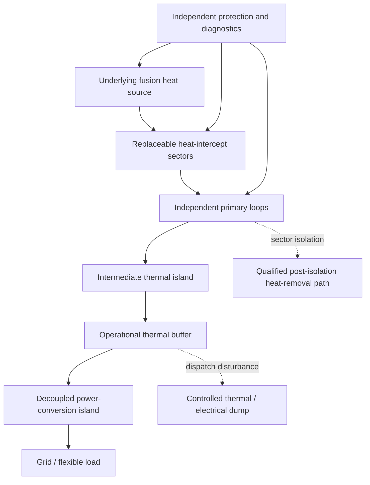

# AURORA / VEILIGHT — Refined Design Specification

**Revision status:** Research architecture; no reactor, propulsion system, or spacecraft claim is validated.  
**Evidence labels:** **[S] sourced**, **[I] inferred**, **[P] proposed**, **[U] unresolved**.

## 1. AURORA — fault-contained fusion thermal architecture

### Purpose and corrected claim

AURORA is a proposed **thermal-containment and flexibility architecture** for a future fusion power plant. It does not attempt to turn fusion into “pure energy,” guarantee that a reactor cannot disrupt, or prescribe a buildable reactor. Its narrower claim is that sectorized heat extraction, an intermediate buffer, and decoupled electrical conversion can be configured so a defined single failure does not propagate into loss of thermal margin in neighbouring sectors.

ITER’s blanket establishes the relevant physical function: it protects key machine structures and magnets, slows high-energy neutrons, transfers their energy to coolant, and faces severe heat-load and materials constraints [1]. The AURORA addition is the **testable integration rule** that the plant must avoid a common, unisolatable energy path between all sectors, the conversion train, and electrical export.

### Physical structure

| Layer | Refined AURORA function | Non-negotiable design rule |
|---|---|---|
| Plasma / magnetic-control layer | Runs the underlying fusion programme’s ordinary protection and controlled-rundown logic. | AURORA does not replace licensed plasma protection. |
| Replaceable heat-intercept sectors | Plasma-facing and blanket-sector assemblies expose local temperature, strain, coolant-flow and radiation signatures. | A sector failure must be detectable without relying on the failed sector’s sole sensor. |
| Primary heat-removal loops | Small, isolate-and-test loops remove sector heat. | Each loop has an independently verifiable isolation and qualified post-isolation removal path. |
| Intermediate thermal island | Receives normal-operation heat through qualified exchangers; includes operational thermal storage. | Buffering is not credited as the only safety heat sink. |
| Conversion island | Converts heat through a separately managed power cycle such as an sCO₂ candidate. | It must tolerate reduced and interrupted thermal input without driving unsafe upstream action. |
| Electrical island | Manages grid export, flexible industrial load, and controlled dumping. | A grid transient cannot force a hazardous thermal transient. |

### Formal requirement and accounting discipline

For heat sector \(i\), let \(M_i\) be validated thermal margin. The programme-level requirement is

\[
\forall i,\quad \mathrm{Fault}(i)\Rightarrow M_j>M_{\min}\ \text{for all neighbouring sectors}\ j\ne i.
\]

This is a test specification, not a claim that every fusion-plant accident is prevented. The operating model must separately account for source heat, captured heat, conversion, parasitic loads, stored energy, qualified heat removal, and losses:

\[
\frac{dU_b}{dt}=P_{\mathrm{captured}}-P_{\mathrm{conversion}}-P_{\mathrm{qualified\,removal}}-P_{\mathrm{loss}}.
\]

Any headline net-electric number is assumption-dependent until all recirculating plant loads and thermodynamic limits are included. The previously illustrative 1 GWₜₕ / 405 MWₑ case remains a transparent sizing example only; it is not a performance forecast.

### Manufacturing sequence and decisive test

The first physical article is not nuclear. It is an electrically heated multi-sector rig with representative flow, valves, structural temperatures, redundant sensors, intermediate buffer and conversion/load emulator. Build qualification should proceed from coupons to loop modules to the integrated rig.

| Gate | Evidence required | Stop condition |
|---|---|---|
| Thermal-sector coupons | Cycling, leak, fatigue and non-destructive inspection data. | Repeated cycling produces uninspectable defects or unacceptable drift. |
| Primary-loop module | Flow blockage, leakage and commanded-isolation data. | Isolation transients violate qualified limits. |
| Multi-sector rig | Pre-registered fault matrix, calibrated data acquisition, independent simulation comparison. | A single induced fault creates an adjacent-sector cascade. |
| Thermal / conversion coupling | Buffer charge-discharge, conversion turndown and safe electrical-islanding test. | Grid or conversion disturbance requires unsafe upstream behaviour. |

## 2. VEILIGHT — externally powered interstellar flyby research path

### Purpose and corrected claim

VEILIGHT is an **uncrewed, flyby-only** architecture for investigating whether an external directed-energy system can accelerate a wafer-scale probe without onboard reaction mass. It does not claim crewed flight, deceleration at the destination, a mission-ready dust shield, or a usable interstellar-energy system.

NASA’s directed-energy study frames the approach as difficult, milestone-dependent, and suitable for progressive small-array, wafer-spacecraft and communications experiments [2]. A 2024 *Nature Communications* study models flexible lightsail configurations with beam-riding and structural stability but notes material, absorption, temperature, perturbation and long-duration damping limitations [3]. The VEILIGHT test programme begins at those limitations, not beyond them.

### Mission architecture

| Element | Refined design | Status |
|---|---|---|
| Energy source | Remote generation portfolio plus pulse-conditioning and a phased optical array. | [P] System architecture; array-scale infrastructure unresolved. |
| Vehicle | Wafer-scale payload, sail, navigation, optical downlink and minimal protection stack. | [P] System integration research object. |
| Sail | Candidate optical membrane whose reflectance, absorptance, emissivity, stress and restoring response are measured together. | [U] No preferred material is declared in advance. |
| Stability | A passive or hybrid passive-damped configuration is selected only after a coupled stability map. | [U] Conditional, not assumed. |
| Dust / gas environment | Forward bumper and distributed swarm redundancy are test subjects, not validated shielding. | [U] Mission-limiting uncertainty. |
| Arrival | High-speed flyby and data transmission only. | [P] Baseline restriction; no braking claim. |

### Governing constraints

The photon-thrust ceiling for reflection is

\[
F\leq \frac{2P}{c}.
\]

The ideal kinetic-energy lower bound remains

\[
E_k=(\gamma-1)mc^2,
\]

which for a 1 g dry payload at \(0.2c\) is approximately 1.853 TJ before sail mass, beam losses, shielding, array efficiency, navigation, manufacture, communication and any deceleration. The bound is useful because it prevents a false claim of cheap propulsion; it is not a mission-energy budget.

### Experimental design that can fail

The first VEILIGHT article is a centimetre-scale sail sample in a vacuum test environment. The experiment sweeps optical power density, beam profile, initial offset, angular error, spin state and temperature. The result set must include reflectance, absorptance, thermal deformation, restoring force/torque, resonance / damping behaviour and damage statistics. It must compare a candidate geometry with a flat specular control.

| Hypothesis | Supporting signature | Falsifier |
|---|---|---|
| Geometry creates restoring beam-riding response. | Perturbed sail returns within a pre-specified capture envelope more reliably than the flat control. | Excursions grow, or required active correction exceeds mass / power allocation. |
| Sail can carry relevant optical load. | Thermal and stress measurements remain within a qualified envelope across cycling. | Absorption, defect growth or deformation causes runaway loss of beam performance. |
| Forward protection is worth carrying. | Exposure tests preserve payload / sail function better than mass-equivalent baseline. | Protection mass or degradation erases mission performance advantage. |

## References

[1] [ITER Organization, “Blanket.”](https://www.iter.org/machine/blanket)

[2] [NASA, “Directed Energy Interstellar Study.”](https://www.nasa.gov/general/directed-energy-interstellar-study/)

[3] [Gao, R., Kelzenberg, M. D. & Atwater, H. A., “Dynamically stable radiation pressure propulsion of flexible lightsails for interstellar exploration,” *Nature Communications* 15, 4203 (2024).](https://www.nature.com/articles/s41467-024-47476-1)
