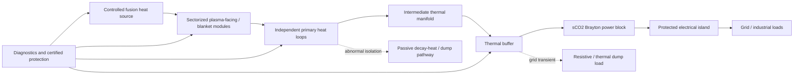
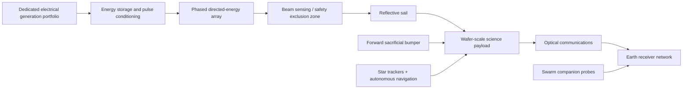

# Invention 1 — AURORA / VEILIGHT: Buffered Fusion Energy and Directed-Energy Interstellar Probe

**Evidence labels:** **[S] sourced**, **[I] inferred**, **[P] proposed design**, **[U] unresolved**.

## Decision statement

The phrase “sun-like pure energy” is redefined as a controlled **fusion heat source plus conversion infrastructure**, not an object that can produce unlimited or directly usable energy. Controlled fusion produces multiple energy carriers that must be absorbed and converted; in deuterium–tritium fusion, this especially includes neutron heat. ITER’s blanket design is a direct precedent: it protects structures and magnets, slows high-energy neutrons, and transfers their energy to coolant [S, 1]. CERN contributes relevant accelerator and magnet technology through its collaboration with Fusion for Energy, but this does **not** mean CERN has an operating fusion power plant [S, 2].

> **Design claim [P]:** AURORA does not try to make a fusion source “incapable of disruption.” It makes disruption **non-propagating** by separating plasma, neutron/heat capture, stored heat, electric conversion, and grid delivery into independently isolatable layers.

| Variant | Function | Mechanism | Status |
|---|---|---|---|
| **AURORA Energy Node** | Convert controllable fusion heat to steady electricity while preventing transient propagation. | Sectorized heat interception, two-loop heat transfer, thermal buffer, fast isolation, and controlled grid export. | Concept; components individually mature/emerging; system integration unproven. |
| **VEILIGHT Probe** | Deliver external energy to a wafer-scale interstellar flyby probe without carrying a fusion reactor. | Phased directed-energy array pushes a reflective sail; a protective forward architecture and onboard autonomy preserve payload function. | Futuristic concept based on directed-energy sail studies; no demonstrated relativistic mission. |

## A. AURORA Energy Node

### 1. Architectural principle

AURORA is a **fault-containment architecture** positioned around a future magnetic-confinement fusion heat source. The new contribution is not a claim to improve plasma physics by naming it differently. Instead, it applies the safety engineering principle of **energy-path segmentation**: a single failure must not provide an uncontrolled path from the plasma-facing surface to the plant-scale coolant inventory, electrical bus, or external grid.

The architecture has five nested shells. The hot plasma is contained by the magnetic system and its ordinary plasma-control and shutdown system. Around it, replaceable plasma-facing and blanket sectors intercept radiation, particles, and neutron energy. A sealed primary heat-transfer loop serves each sector or small sector group and returns energy to an intermediate thermal manifold. A separate, non-radioactive secondary loop powers the conversion block and a high-temperature storage buffer. The electrical island operates in grid-following or grid-forming mode behind a high-speed breaker and black-start-capable storage. This keeps the functions of confinement, heat capture, energy buffering, and power delivery separate.

| Layer | Primary purpose | Proposed AURORA feature | Failure containment function |
|---|---|---|---|
| 0: plasma-control zone | Sustain or terminate plasma safely. | Existing-class diagnostics and predictive controller; no autonomous override of certified protection. | Triggers controlled rundown before thermal margins are consumed. |
| 1: modular first wall / blanket | Absorb heat and neutron kinetic energy. | Replaceable “energy tiles” with local temperature, strain, flow, and radiation diagnostics. | Limits a fault to a module; supports maintenance by condition rather than calendar alone. |
| 2: primary loop | Remove sector heat. | Small-inventory, independently valved loops with passive drain / dump heat path. | A leak or blockage affects one segment instead of the entire heat-collection system. |
| 3: intermediate thermal bus | Decouple the nuclear island from conversion. | Thermally stratified buffer with two independent heat exchangers. | Absorbs short power excursions and lets turbines remain inside ramp limits. |
| 4: power island and grid interface | Produce useful electricity. | Closed sCO₂ Brayton conversion block, synchronous / grid-forming inverter, dump load. | Prevents an electrical transient from commanding unsafe heat-side changes. |

### 2. Energy path and why it avoids an “explosion” claim

The normal path is **fusion heat → sector coolant → intermediate thermal store → sCO₂ power cycle → electrical bus → grid / flexible load**. The credible safety strategy is not to “hold all energy inside.” It is to provide specified low-risk destinations for energy during abnormal conditions: reduced fusion power, a passive heat sink, a thermal buffer, a controlled dump load, and a grid disconnect.

ITER documents the relevant first principle: its actively cooled blanket removes heat while shielding the vessel and magnets; a later fusion power plant would use the recovered heat for electricity [S, 1]. DOE identifies sCO₂ Brayton cycles as potentially high-efficiency and compact heat-to-power systems, while noting high-temperature durability and components as active hurdles [S, 3]. Therefore the AURORA thermal bus is plausible as a research direction, not proven as an integrated reactor solution.

### 3. Formal model and design invariant

**Definition [P].** Let \(U_b\) be thermal energy in the buffer, \(P_f\) source heat, \(P_c\) captured heat, \(P_e\) heat sent to conversion, \(P_s\) passive safety removal, and \(P_\ell\) loss. The plant-level accounting model is

\[
\frac{dU_b}{dt}=P_c-P_e-P_s-P_\ell,\qquad 0\le U_b\le U_{b,\max}.
\]

For each thermal sector \(i\), the protection controller must preserve the margin condition

\[
M_i=T_{i,\mathrm{limit}}-T_i-\tau_i\,\max(0,\dot T_i)>M_{\min},
\]

where \(\tau_i\) is the measured/validated response latency from a detected thermal excursion to a verified reduction in sector heat input. This is a **proposed control invariant**, not a new law of physics. AURORA succeeds only if it keeps \(M_i\) positive under a defined set of postulated single-fault transients.

| Planning value | Calculation basis | Interpretation |
|---|---:|---|
| Thermal source target | 1.00 GWₜₕ [P] | A reference point to size the architecture, not a reactor output claim. |
| Gross electric output | 450 MWₑ [P] | At an assumed 45% thermal conversion. DOE reports sCO₂ systems have potential for >50% thermal efficiency under suitable conditions, but 45% is intentionally conservative for this concept [S, 3]. |
| Auxiliary allowance | 45 MWₑ [P] | 10% of gross planning reserve for pumps, controls, cryogenics, and balance-of-plant; must be replaced by a detailed plant model. |
| Net planning output | 405 MWₑ [I] | Gross less the stated auxiliary allowance. |
| Two-hour thermal buffer | 7.20 TJ [I] | \(1\,\mathrm{GW}\times2\,\mathrm{h}\); it buffers a full-thermal-output interruption, not the energy of a catastrophic event. |

### 4. Key hardware and manufacturing development path

The construction target is a **non-nuclear thermal demonstrator first**. It should use electrically heated sector mockups with conservative heat flux, instrumented metal panels, a compatible non-radioactive heat-transfer fluid, intermediate heat exchanger, thermal storage vessel, and a small conversion / dump-load interface. The demonstration must validate segmentation, fault isolation, thermal-mass model calibration, valve closure behavior, sensor survivability, and safe rundown logic before any fusion coupling is contemplated.

| Subsystem | Candidate manufacturing route | Qualification gate | Principal unresolved risk |
|---|---|---|---|
| Replaceable energy tiles | Powder metallurgy or additive manufacturing plus machining; bonded cooling channels where materials data allow. | Thermal cycling, erosion surrogate testing, non-destructive inspection. | Neutron damage and tritium behavior require fusion-relevant facilities. |
| Sector manifolds / primary loops | High-integrity welded pipe modules with isolate-and-test spools. | Leak-before-break analysis; pressure, vibration, and flow-blockage tests. | Coupled electromagnetic, thermal, and radiation loads. |
| Intermediate thermal store | Fabricated insulated vessel with stratification instrumentation. | Charge/discharge cycling and heat-leak accounting. | Salt compatibility, freeze management, and serviceability. |
| sCO₂ conversion island | Commercially relevant turbomachinery / recuperator development path. | High-temperature corrosion, seals, transient control. | Availability and material lifetime in a fusion-coupled environment. |
| Safety / supervisory software | Certified control platform with independent protection channel. | Hardware-in-the-loop fault injection and formal hazard analysis. | Sensor drift, common-mode failures, and cyber-resilience. |

### 5. Smallest decisive test

A 1–10 MWₜₕ electrically heated AURORA sector rig should inject programmable heat pulses and induced failures into one module while its neighbours remain operational. The concept is **supported** only if the rig demonstrates, with independently calibrated instrumentation, that (a) the affected loop isolates within its validated safe thermal margin, (b) no neighbouring sector exceeds its temperature/pressure limits, and (c) the conversion island remains either stable or intentionally transitions to a safe reduced-output state. A result showing cascading temperature rise, unsafe stored-energy release, or unmanageable sensor latency falsifies the present architecture and requires redesign.

## B. VEILIGHT Probe: fusion-enabled infrastructure, external propulsion

### 1. Mission boundary

VEILIGHT redesigns the “sun-like energy” idea for interstellar travel by moving the energy source **off the spacecraft**. A future high-output power infrastructure—including, but not limited to, AURORA-class fusion plants—could supply a directed-energy array. The craft itself carries a gram-scale payload, sail, navigation, communication, and protection. This avoids the impossible mass penalty of carrying a reactor and propellant to near-light speed, but it does not make the task easy.

NASA’s DEEP-IN study explicitly proposed directed-energy propulsion combined with wafer-scale spacecraft as a futuristic but technically credible route for small probes, while also stating that the technological challenges are formidable [S, 4]. Its appropriate near-term mission is an **uncrewed flyby**, not a human-carrying spacecraft and not a claim of arrival and return.

| Element | VEILIGHT design choice | Reasoning |
|---|---|---|
| Mission | One-way flyby at a target velocity no greater than 0.2c in the initial concept. | Keeps the concept aligned with wafer-scale directed-energy studies and does not hide deceleration energy. |
| Power source | Offboard, geographically and electrically isolated phased energy array fed from a diversified grid. | The power source supplies photon momentum; the probe need not carry fusion fuel. |
| Sail | Ultrathin, high-reflectivity, thermally managed sail with passive shape-restoring geometry. | Reflection maximizes available photon momentum per incident energy; the exact material remains [U]. |
| Payload | Radiation-tolerant wafer electronics, compact instruments, optical communications, clocks, star trackers. | Reduces mass and enables parallel swarm redundancy. |
| Protection | Replaceable forward sacrificial bumper; nested standoff layers; robust error correction and swarm redundancy. | Interstellar gas and dust remain a central unresolved hazard. |
| Destination strategy | Flyby only. Deceleration is an explicit follow-on challenge, not assumed. | A spacecraft that must stop needs comparable momentum removal. |

### 2. Propulsion accounting

For a reflective sail receiving directed optical power \(P\), the ideal upper-bound photon thrust is

\[
F\leq\frac{2P}{c}.
\]

For a payload of rest mass \(m\), the lower bound on kinetic energy at velocity \(v\) is

\[
E_k=(\gamma-1)mc^2,\quad\gamma=(1-v^2/c^2)^{-1/2}.
\]

The 1 g reference payload requires an ideal minimum of approximately **1.85 TJ (514.8 MWh)** merely to reach 0.2c [I, calculation file]. That lower bound omits the sail, beam losses, array inefficiency, pointing loss, shielding, navigation, communication, vehicle manufacture, and deceleration. A 0.2c **flyby** of Alpha Centauri distance would take roughly two decades in cruise, before observing and transmitting data; this timing is an order-of-magnitude implication rather than a mission schedule.

| Reference velocity, 1 g dry payload | \(\gamma\) | Ideal kinetic-energy lower bound | Scientific meaning |
|---|---:|---:|---|
| 0.10c | 1.005038 | 0.453 TJ / 125.8 MWh | Large but not relativistically extreme; still leaves engineering losses. |
| 0.20c | 1.020621 | 1.853 TJ / 514.8 MWh | Reference flyby ambition. |
| 0.50c | 1.154701 | 13.90 TJ / 3,862 MWh | Demonstrates rapidly growing demand; not a baseline. |
| 0.90c | 2.294157 | 116.3 TJ / 32,309 MWh | Excluded from the baseline; shielding, thermal and array requirements become far more severe. |

### 3. System architecture

The apparent “invention” is the **mission-level coupling** of a thermal-buffered generation portfolio, pulse-conditioned beam array, passive self-stabilizing sail, and swarm-level fault tolerance. It does not propose a novel laser weapon, a reactor-driven spacecraft, or a propulsion method that evades conservation of momentum.

### 4. Build sequence and gates

| Stage | Deliverable | Go/no-go measurement |
|---|---|---|
| 0: numerical model | Coupled beam–sail dynamics and thermal model, independently reproduced. | Model predicts stability and temperature for intentionally perturbed sail geometry. |
| 1: laboratory sail coupon | Material coupon in vacuum with calibrated optical loading. | Reflectance, absorptance, thermal deformation, and damage threshold match the model. |
| 2: centimetre demonstrator | Subscale sail and payload surrogate in a safe vacuum beamline. | Passive centring and controlled acceleration without destructive thermal warp. |
| 3: orbital technology demonstrator | Low-velocity, non-interstellar sail mission. | Pointing, communications, navigation, and post-exposure material survivability. |
| 4: array-scale decision | Independent safety, environmental, governance, and debris-risk review. | Proceed only with a verified safe beam-control regime and international-use governance. |

### 5. Falsifiers and risks

VEILIGHT is **not yet validated**. It fails its design claim if a sail cannot keep absorptance low enough to remain within a qualified temperature envelope, if beam-riding stability requires active actuators too massive for the craft, if dust/particle damage destroys a representative payload at the target speed, or if an array cannot meet a credible independent beam-safety case. The strongest rival is a slower solar/electric interstellar precursor; it is far less ambitious but requires no unprecedented beam infrastructure. The second rival is a fusion or antimatter rocket, but such options inherit extreme reaction-mass, thermal, and energy-production burdens.

## Validation scorecard

| Criterion | AURORA Energy Node | VEILIGHT Probe |
|---|---|---|
| Mechanism clarity | Medium–high; energy segmentation is explicit. | Medium; photon momentum is clear, but materials and full mission system remain unresolved. |
| Evidence quality | Medium; blanket and sCO₂ components have strong institutional support but not the proposed integration. | Medium–low; directed-energy concept is supported as a study, not as a demonstrated interstellar system. |
| Conservation accounting | Pass at architecture level. | Pass for stated ideal lower bound; lifecycle accounting incomplete. |
| Feasibility horizon | Long term; depends on fusion power plant maturity. | Very long term; only subscale sail experiments are presently suitable. |
| Safety / governance | High engineering and nuclear safety burden. | High beam-safety and dual-use governance burden. |
| Next action | Non-nuclear thermal-sector demonstrator. | Vacuum sail coupon and low-velocity beam-riding experiment. |

## References

[1] [ITER Organization, “Blanket.”](https://www.iter.org/machine/blanket)

[2] [CERN, “CERN and fusion energy, advancing together.”](https://home.cern/cern-and-fusion-energy-advancing-together/)

[3] [U.S. Department of Energy, “sCO₂ Power Cycles.”](https://www.energy.gov/sco2-power-cycles)

[4] [NASA, “DEEP IN: Directed Energy Propulsion for Interstellar Exploration.”](https://www.nasa.gov/general/deep-in-directed-energy-propulsion-for-interstellar-exploration/)
