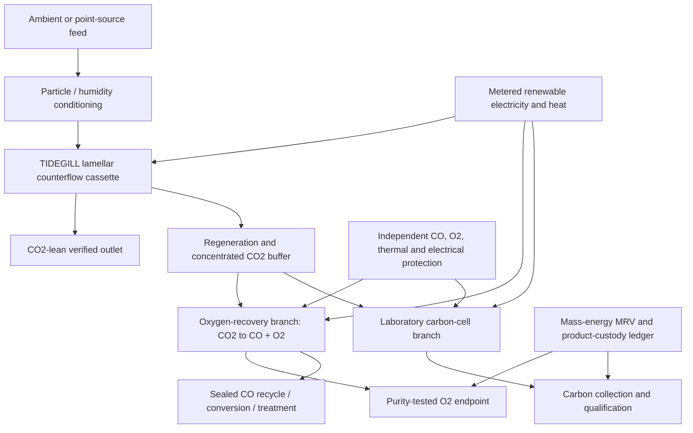

# TIDEGILL — Refined Design Specification

**Revision status:** Capture-contactor research programme plus separately gated oxygen-recovery and carbon-electrochemistry experiments.  
**Evidence labels:** **[S] sourced**, **[I] inferred**, **[P] proposed**, **[U] unresolved**.

## Purpose and corrected claim

TIDEGILL is a **gas–sorbent contactor-control hypothesis** inspired by the structural transport logic of fish gills. It claims neither a passive CO₂ splitter nor a universal carbon factory. The biological transfer is restricted to the trade-off between exchange area, channel resistance, counterflow and pumping work. Fish-gill analysis directly supports this type of optimization question: closely spaced lamellae increase transfer area while creating viscous resistance [1].

TIDEGILL is split into three independently auditable programmes:

1. **TIDEGILL Capture Cassette:** Tests whether lamellar counterflow geometry improves captured CO₂ per fan-plus-regeneration energy over a conventional contactor using the same sorbent and feed.
2. **TIDEGILL Oxygen Recovery:** Uses a sealed, separately engineered CO₂ electrolysis branch to recover oxygen with carbon monoxide accounted for and contained. NASA’s MOXIE demonstrates the relevant oxygen-from-CO₂ principle, not an elemental-carbon process [2].
3. **TIDEGILL Carbon Cell:** A laboratory-only exploration of direct solid-carbon electrolysis and product qualification. It does not inherit a commercial or climate-removal claim from the capture cassette.

## Physical process architecture

## Capture Cassette

### Mechanism

The cassette contains parallel gas, capture-medium and regeneration pathways. Gas and regeneration flows are arranged in counterflow. Each cassette is modular and instrumented for CO₂, humidity, temperature, pressure drop, capture-medium condition, liquid conductivity where relevant, and leak / breakthrough detection. The geometry can change **which pressure-drop / mass-transfer trade-off is achievable**; it cannot manufacture a chemical driving force or replace sorbent selectivity.

A general performance report keeps unlike energy inputs separate:

\[
e_{\mathrm{electric}}=\frac{E_{\mathrm{electric,total}}}{m_{\mathrm{CO_2,captured}}},\qquad
q_{\mathrm{thermal}}=\frac{Q_{\mathrm{regeneration,total}}}{m_{\mathrm{CO_2,captured}}}.
\]

The electric boundary includes fans, conditioning, controls, compression, and
CO₂ handling. Report regeneration heat separately. Do not add thermal and
electric joules into a single advantage score unless a disclosed site-specific
primary-energy or exergy method converts them to a common basis. The test is
meaningful only when both candidate and baseline share feed concentration,
humidity, sorbent mass, contact time / outlet specification, pressure-drop cap,
measurement uncertainty, and cycling protocol.

| Component | Design function | Evidence needed before scale-up |
|---|---|---|
| Conditioned inlet | Controls dust and water so geometry is not confounded by uncontrolled fouling. | Pressure drop, capture-medium contamination and condensation data. |
| Lamellar plate stack | Provides controlled exchange area and counterflow path. | Flow visualization, leak integrity, manufacturable tolerance and cleanability. |
| Capture medium | Supplies the actual selective chemical / electrochemical interaction. | Capacity, kinetics, regeneration energy, impurity sensitivity and cyclic lifetime. |
| Regeneration path | Produces a controlled concentrated CO₂ stream. | Purity, water balance, energy and crossover data. |
| Instrumentation spine | Makes an auditable claim possible. | Calibrated drift, response, redundancy and maintenance data. |

### Decisive benchmark

The initial 1–10 kg CO₂/day rig must run a lamellar cassette and a conventional
monolith in parallel. Pre-register separate limits for electrical energy per
captured mass and regeneration heat per captured mass, including pressure
drop, conditioning, CO₂ handling, cycling degradation, and uncertainty. Report
both outcomes separately; do not use one combined \(\Phi\) unless a disclosed
primary-energy or exergy method converts them to a common basis. A visually
larger exchange area is not a success metric.

## Oxygen Recovery

The oxygen-recovery branch uses the reaction family

\[
\mathrm{2CO_2\rightarrow2CO+O_2}.
\]

MOXIE’s documented operation demonstrates oxygen extraction from CO₂ under its specific conditions [2]. TIDEGILL does not project MOXIE output or performance to terrestrial capture streams. Carbon monoxide is treated as a toxic process intermediate: it remains contained, monitored, measured and sent to a defined recycle, conversion or treatment route. Oxygen is treated as a product only after purity, pressure, contamination and authorised endpoint requirements are met; atmospheric release is never the default use.

## Carbon Cell

The idealized net transformation

\[
\mathrm{CO_2\rightarrow C+O_2}
\]

is thermodynamically uphill. The approximately 2.49 MWh/tCO₂ reversible minimum in the prior analysis is only a lower bound; a real cell also incurs capture, heating, overpotential, separation, conversion, finishing and material-replacement burdens. NIST’s CO₂ thermochemistry supports the direction of the energy requirement [3].

The carbon-cell programme begins with four measurements, not a product promise: faradaic selectivity, energy per recovered mass, electrode / electrolyte lifetime, and recovered-solid properties. Battery-grade use is a separate qualification programme requiring impurity, morphology, particle-size, conductivity, electrochemical and safety evidence. Carbon used as a fuel or reductant is logged as **carbon recycling**, not durable removal.

| Carbon disposition | Accounting label | Requirement |
|---|---|---|
| Mineralized or demonstrably long-lived structural material | Potential durable storage. | Verified durability and custody pathway. |
| Qualified speciality conductive carbon | Product storage; duration depends on use. | Lot-level material and customer qualification. |
| Carbon black / filler | Use-dependent storage. | Dust, trace impurity and lifecycle evidence. |
| Fuel or reductant | Recycled / delayed emission. | Full use-phase CO₂ accounting; no durable-removal credit. |

## Safety and manufacturing sequence

| Stage | Build | Required result | Stop rule |
|---|---|---|---|
| 0 | Coupon plates and capture-medium samples. | Area–pressure-drop, compatibility and cleaning relationship. | Fouling or resistance negates the geometry benefit. |
| 1 | Dual-path capture rig. | Valid baseline comparison against monolith. | No practical energy-normalized advantage after cycling. |
| 2 | Sealed oxygen-recovery prototype. | Closed CO mass balance and qualified O₂ analysis. | CO/O₂ crossover, uncontained leak or unsafe thermal/electrical event. |
| 3 | Independent carbon-cell bench. | Reproducible deposit, energy and degradation measurements. | No stable deposition or no credible material-quality pathway. |
| 4 | Pilot decision. | Third-party MRV, lifecycle and maintainability review. | Process advantage disappears outside a controlled laboratory regime. |

## References

[1] [Park, K., Kim, W. & Kim, H.-Y., “Optimal lamellar arrangement in fish gills,” *PNAS* 111(22), 8067–8070 (2014).](https://www.pnas.org/doi/10.1073/pnas.1403621111)

[2] [NASA, “NASA’s Oxygen-Generating Experiment MOXIE Completes Mars Mission.”](https://www.nasa.gov/missions/mars-2020-perseverance/perseverance-rover/nasas-oxygen-generating-experiment-moxie-completes-mars-mission/)

[3] [NIST Chemistry WebBook, “Carbon dioxide.”](https://webbook.nist.gov/cgi/cbook.cgi?ID=C124389&Mask=1)
