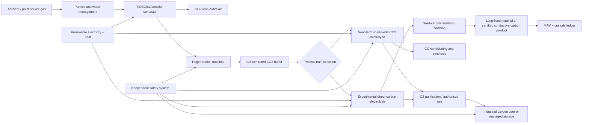

# Invention 2 — TIDEGILL: Gill-Geometry Carbon Dioxide Capture, Oxygen Recovery, and Carbon-Materials Loop

**Evidence labels:** **[S] sourced**, **[I] inferred**, **[P] proposed design**, **[U] unresolved**.

## Executive definition

TIDEGILL is a modular carbon-management system that borrows **flow geometry** from fish gills—many thin exchange channels, counterflow, distributed sensing, and an optimized trade-off between transfer area and pumping loss—but supplies the missing chemical driving force with electricity and selective sorbents. It is not a passive device that splits atmospheric CO₂ into carbon and oxygen.

> **Design claim [P]:** A lamellar, electrically switchable contactor can increase useful gas–sorbent mass transfer per unit of fan energy relative to a conventional monolithic contactor, while its downstream modules keep capture, oxygen recovery, carbon conversion, and safety-critical gas separation physically isolated.

Fish-gill studies show that lamellar arrangements must balance transfer surface area against viscous resistance; the relevant transferable insight is therefore a geometric and transport optimization problem, not biological chemistry [S, 1]. NASA’s MOXIE has already demonstrated a different but related capability: electrochemical removal of oxygen from pumped CO₂, producing oxygen as an output [S, 2].

## 1. The non-negotiable chemistry

The requested final separation is

\[
\mathrm{CO_2\rightarrow C+O_2}.
\]

It is a **thermodynamically uphill** reaction. Reversing CO₂ formation needs an ideal minimum of approximately \(394.37\;\mathrm{kJ\,mol^{-1}}\) at standard conditions, before capture work, electrochemical losses, heating, compression, separations, and finishing. NIST reports CO₂ molar mass \(44.0095\;\mathrm{g\,mol^{-1}}\) and standard enthalpy of formation of approximately \(-393.51\;\mathrm{kJ\,mol^{-1}}\) [S, 3]. The energy accounting below is deliberately an ideal lower bound, not a plant-energy estimate.

| Per 1 metric tonne captured CO₂ | Theoretical stoichiometric value | Meaning |
|---|---:|---|
| CO₂ processed | 1,000 kg | Input carbon source. |
| Elemental carbon maximum | 272.9 kg [I] | Requires that all carbon is retained and finished as a usable solid. |
| O₂ maximum | 727.1 kg [I] | Requires complete splitting and no side losses. |
| Reversible minimum splitting energy | 8.96 GJ / 2.49 MWh [I] | Excludes every real-world loss and the energy to capture CO₂ from air. |
| Climate-removal condition | Not automatic [I] | Carbon must remain durably stored; using it as fuel or making coal-like fuel returns CO₂ on use. |

### Why “coal manufacture” is not a removal endpoint

Natural coal is a geological material with heterogeneous organic composition. A plant can make a **coal-like carbon briquette** or synthetic reductant, but burning it releases the captured carbon back to CO₂. TIDEGILL therefore prioritizes mineralized or long-lived material products, then high-purity conductive-carbon intermediates. Carbon for battery manufacture is a demanding speciality product: ash, metals, particle size, morphology, conductivity, and batch traceability must meet the cathode/anode producer’s specification. The concept does not claim every captured-carbon batch can become battery material.

## 2. System cycle

TIDEGILL is deliberately organized as five isolated islands. The first captures CO₂. The second concentrates it. The third makes a chosen product; it has a near-term oxygen-recovery branch and an experimental carbon-plus-oxygen branch. The fourth certifies and directs products. The fifth measures the actual carbon-removal and energy balance.

## 3. The TIDEGILL contactor

### 3.1 Structural transfer from fish gills

The contactor consists of removable cassette plates, each with three adjacent channel families: a humidified gas channel, a thin selective capture layer, and a regenerant / electrolyte channel. Gas and regenerant travel in opposing directions. The controller varies channel velocity, humidity, electrical regeneration schedule, and bypass fraction to maintain a favourable CO₂ driving force while bounding pressure drop and flooding.

The key physical contradiction is that thinner and denser channels increase interfacial area but also raise pumping work and fouling susceptibility. The proposed response is **dynamic lamellar spacing**: cassettes are partitioned into zones with different nominal gaps and can be electrically / hydraulically bypassed. This is not a claim that mechanically moving microlamellae will be reliable; it is a testable modular-control hypothesis.

| Component | Proposed design | Function | Build / material requirements |
|---|---|---|---|
| Inlet conditioning | Replaceable coarse and fine particulate filters; humidity sensing and condensate trap. | Protects capture surfaces and stabilizes water balance. | Corrosion-resistant housing; accessible filter trays; differential-pressure sensors. |
| Lamellar cassette | Repeated plate stack with gas, capture, and regenerant paths; 3D manifold. | Maximizes controllable mass-transfer area per module volume. | Laser-welded or bonded plate pack; chemical compatibility testing; leak-testable headers. |
| Capture layer | Candidate supported amine, carbonate, or redox-active electro-swing medium selected by source concentration. | Temporarily binds or transports CO₂. | Accelerated aging in humidity, SOx/NOx, oxygen, dust, and thermal cycles. |
| Regeneration bus | Pulsed electrical or thermal-electrical desorption loop. | Releases a concentrated CO₂ stream without mixing it into product gases. | Insulated, instrumented piping; electrical isolation; gas-tight valves. |
| Sensor spine | CO₂, O₂, humidity, temperature, pressure-drop, liquid conductivity, and module leakage sensors. | Verifies performance and identifies fouling / breakthrough. | Field-calibration ports; redundant safety sensors separated from process control. |

### 3.2 Contactor performance model

**Definition [P].** The first-order capture capacity model is

\[
\dot n_{\mathrm{CO_2}} = K_G a V\,\Delta p_{\mathrm{lm}},
\]

where \(K_G\) is an overall gas-side mass-transfer coefficient, \(a\) is effective wetted / reactive area per volume, \(V\) is contactor volume, and \(\Delta p_{\mathrm{lm}}\) is the log-mean CO₂ partial-pressure driving force. Fan power rises with flow and pressure drop, approximately \(P_{\mathrm{fan}}=\Delta p\,\dot V/\eta_f\). The proposed optimization is

\[
\max_{g,\,u,\,\sigma}\quad \frac{\dot n_{\mathrm{CO_2}}}{P_{\mathrm{electric,total}}}
\qquad\text{and separately minimize}\qquad
\frac{Q_{\mathrm{regen}}}{\dot n_{\mathrm{CO_2}}}
\]

subject to a maximum pressure drop, outlet CO₂ target, capture-medium water balance, maximum temperature, and a verified containment condition. Here \(g\) is channel gap, \(u\) is gas velocity, and \(\sigma\) is regeneration duty cycle. \(P_{\mathrm{electric,total}}\) includes fans, conditioning, controls, compression, and CO₂ handling; \(Q_{\mathrm{regen}}\) is reported as thermal input. Do not combine them without a disclosed primary-energy or exergy conversion. This is a **design optimization statement**, not a validated performance equation for a chosen sorbent.

## 4. Downstream chemical trains

### Train A — Near-term oxygen recovery and carbon monoxide intermediate

A solid-oxide CO₂ electrolysis module implements

\[
\mathrm{2CO_2\rightarrow2CO+O_2}.
\]

This is the pathway directly analogous to the oxygen-recovery principle demonstrated by MOXIE, which separates one oxygen atom from each CO₂ molecule electrochemically [S, 2]. The output is oxygen plus carbon monoxide—not stable elemental carbon. CO must be sealed, continuously monitored, and either converted in a contained downstream synthesis train or recycled. It must never enter occupied or public air.

This branch is the **earliest credible hardware path** because it separates the two desirable functions: oxygen recovery is useful for a documented process, while carbon conversion is treated as its own chemical-production challenge.

### Train B — Experimental direct solid-carbon route

An experimental high-temperature electrochemical train, such as a molten-carbonate family of processes, is proposed to target

\[
\mathrm{CO_2+4e^-\rightarrow C+2O^{2-}},\qquad \mathrm{2O^{2-}\rightarrow O_2+4e^-}.
\]

The net reaction is the stated \(\mathrm{CO_2\rightarrow C+O_2}\). This oxide-ion bookkeeping pair is balanced, but it is not asserted as the universal mechanism for any particular molten-carbonate cell; use reactions specific to the selected electrolyte and electrode process. The critical question is not whether charge can be balanced; it is whether solid carbon can be continuously formed, collected, purified, and qualified with an energy and maintenance burden that makes sense. The starting readiness is **laboratory research only**. It requires a separate high-temperature safety envelope and does not share a process volume with the air-contacting capture unit.

| Decision | Train A: CO + O₂ | Train B: C + O₂ |
|---|---|---|
| Primary output | Oxygen plus sealed CO intermediate. | Oxygen plus solid-carbon intermediate. |
| Evidence anchor | MOXIE demonstrates the oxygen-from-CO₂ principle [S, 2]. | Literature area exists but is process- and morphology-dependent; no product claim made [U]. |
| Technical readiness in this concept | System-integration research. | Laboratory research. |
| Main safety issue | Carbon monoxide toxicity plus oxygen-enrichment fire risk. | High temperature, corrosive electrolyte, electrical hazard, oxygen-enrichment, and product contamination. |
| Product strategy | Feed CO to an authorised contained synthesis/recycle loop. | Classify solid carbon by impurities and morphology before any commercial use. |

## 5. Product policy: use oxygen and carbon without a false climate claim

Oxygen should be supplied only after pressure, purity, moisture, trace contaminant, and safety certification are established for a defined customer. Potential endpoints include authorised industrial oxidation, wastewater aeration, medical-grade production after a separate regulated purification route, or storage. **Ambient release is not the default “benefit”; oxygen-rich discharge can raise fire risk and must be managed under site permitting.**

Carbon has three honest disposition classes. First, a stable, traceable material product can be retained in durable composite, infrastructure, or mineralized form. Second, a qualified conductive-carbon product could enter a battery-material supply chain only after purity and electrochemical testing. Third, a reducing agent or synthetic carbon fuel may be commercially valuable but must be logged as a **closed-loop / delayed-emissions product**, not counted as durable carbon removal.

| Carbon disposition | Climate-accounting label | Required gate |
|---|---|---|
| Mineralized / durable structural carbon composite | Potential durable storage. | Independent durability, end-of-life, and chain-of-custody assessment. |
| Battery-grade conductive carbon / graphite precursor | Product storage with uncertain duration. | Lot-level impurity, morphology, conductivity, electrochemical, and safety qualification. |
| Carbon black / filler | Product storage with use-dependent duration. | Customer specification, dust safety, and life-cycle assessment. |
| Coal-like briquette / synthetic reductant / fuel | Carbon recycling, **not removal** when oxidized. | Explicit use-phase CO₂ accounting; no durable-removal credit. |

## 6. Safety, monitoring, and lifecycle controls

| Hazard | Design control | Verification |
|---|---|---|
| CO exposure | Physically isolated CO train, welded containment, redundant fixed CO detectors, negative-pressure enclosure and emergency oxidation / capture pathway. | Leak test, detector bump-test, emergency response drill. |
| O₂ enrichment | Dedicated oxygen-rated piping and materials, clean service procedures, remote vent / storage, separation from ignition sources and hydrocarbons. | Purity analysis, oxygen-cleanliness audit, hazardous-area review. |
| High-temperature electrolysis | Separate refractory enclosure, interlocks, thermal barrier, emergency power-down and cooling. | Thermal runaway / heater fault test; independent functional-safety review. |
| Capture-medium degradation | Modular cassettes, chemistry monitoring, breakthrough detection, controlled regeneration. | Aging campaign under representative impurities and humidity. |
| False climate accounting | Mass flowmeters, calibrated gas analysis, electricity provenance, product custody ledger, third-party MRV. | Carbon balance closes within pre-specified uncertainty. |

## 7. Manufacturing and deployment sequence

The first build should be a **bench-scale non-production demonstrator**, not a direct-air-capture factory. It should process a controlled CO₂ / air mixture and use a safe regeneration path while the carbon-conversion modules are represented by a simulator or sealed test rig. Only after capture geometry is benchmarked should the oxygen-recovery branch be coupled. The direct-carbon branch is last.

| Stage | What is built | Success criterion | Stop condition |
|---|---|---|---|
| 0: model and cassette coupons | Printed / machined channel coupons, flow visualization, sorbent screening. | Demonstrate a reproducible area–pressure-drop curve and chemical compatibility. | Fouling or pressure penalty overwhelms added transfer. |
| 1: 1–10 kg CO₂/day contactor | Instrumented cassette rack with conventional monolith baseline. | At equal outlet CO₂ target and equal fan + regeneration energy, improve capture-rate metric by pre-registered threshold. | No improvement or unacceptable sorbent degradation after cycling. |
| 2: integrated concentration / O₂ unit | Train A with sealed CO handling and oxygen analysis. | Mass balance closes; oxygen and CO streams meet containment / purity specifications. | CO crossover, oxygen contamination, or unsafe electrical/thermal behaviour. |
| 3: direct-carbon electrolysis bench | Separate Train B cell with independent exhaust and material characterization. | Carbon deposition can be continuously recovered and classified; energy and electrode life measured. | Contamination, rapid corrosion, unstable deposition, or no credible energy path. |
| 4: 1 t CO₂/day pilot decision | Modular field pilot at an appropriate point source. | Third-party MRV and full lifecycle energy / material balance. | Net lifecycle emissions are not demonstrably lower than the chosen baseline. |

## 8. Validation scorecard

| Criterion | Assessment |
|---|---|
| Mechanism clarity | High for the geometry–pressure-drop hypothesis; medium for full chemistry integration. |
| Prior-art boundary | Gill geometry and CO₂ electrolysis are known mechanism families; the proposed contribution is their controlled, modular coupling. This is not a patentability finding. |
| Feasibility | Contactors and oxygen recovery have plausible experimental paths; continuous, economical direct elemental-carbon production is unresolved. |
| Falsifier | The invention fails if the lamellar contactor cannot outperform the selected baseline at matched energy and outlet specification, or if the downstream carbon route cannot close its mass/energy balance with usable product quality. |
| Cheapest decisive test | Side-by-side cassette vs. monolith test with identical sorbent inventory, gas composition, capture target, and calibrated energy meters. |
| Confidence | Moderate for research usefulness; low for commercial performance until material, lifecycle, and safety results exist. |

## References

[1] [Park, K., Kim, W. & Kim, H.-Y., “Optimal lamellar arrangement in fish gills,” *PNAS* 111(22), 8067–8070 (2014).](https://www.pnas.org/doi/10.1073/pnas.1403621111)

[2] [NASA, “NASA’s Oxygen-Generating Experiment MOXIE Completes Mars Mission” (2023).](https://www.nasa.gov/missions/mars-2020-perseverance/perseverance-rover/nasas-oxygen-generating-experiment-moxie-completes-mars-mission/)

[3] [NIST Chemistry WebBook, “Carbon dioxide.”](https://webbook.nist.gov/cgi/cbook.cgi?ID=C124389&Mask=1)
