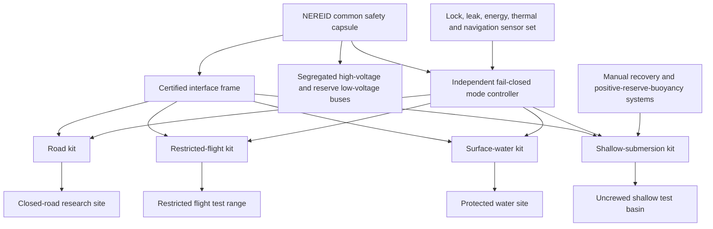

# NEREID — Refined Design Specification

**Revision status:** Uncrewed common-safety-capsule research platform; integrated four-mode consumer vehicle claim withdrawn.  
**Evidence labels:** **[S] sourced**, **[I] inferred**, **[P] proposed**, **[U] unresolved**.

## Purpose and corrected claim

NEREID is reframed as the **NEREID Common Safety Capsule Platform**. It is an instrumented, protected capsule with standard mechanical, electrical, data, thermal and emergency interfaces. One domain kit is attached and qualified at a time: road, restricted-flight, surface-water or shallow-submersion. A combined four-mode configuration remains an optional late research experiment, not the intended initial product.

This is a stronger design because it exposes the real contradiction: a deep-pressure boundary, large buoyancy reserve, road crash structure, flight mass fraction, distributed lift redundancy and water-corrosion control cannot be assumed to coexist efficiently in a single consumer vehicle. FAA AC 21.17-4 confirms that powered-lift alone has a separate type, production and airworthiness certification path [1]. Road, marine and submersible evidence must not be disguised as aviation evidence.

## Platform architecture

## Common capsule

The capsule carries occupants only in a later, separately approved phase. Early articles carry instruments, ballast surrogate and safe battery emulator. It is deliberately rounded or otherwise curvature-dominated at the water interface because curved shells are structurally more appropriate than flat panels for external pressure, but no depth rating is inferred from this choice.

| Capsule subsystem | Function | Mandatory proof before kit integration |
|---|---|---|
| Interface frame | Defines standard load paths and locking geometry. | Static, fatigue, vibration and corrupted-sensor lock-state evidence. |
| Electrical spine | Segregates traction / lift power from control and recovery reserve. | Dielectric monitoring, immersion-fault isolation, contactor and manual-service-disconnect tests. |
| Leak boundary | Protects instrumentation and energy system in water operations. | Vacuum / pressure cycle, ingress sensing, dewatering and post-test inspection. |
| Mode controller | Rejects unsafe configuration changes independently of high-level autonomy. | Hardware fault-injection matrix showing fail-closed transitions and recoverable states. |
| Recovery hardware | Supports manual recovery, towing, and positive ascent in submersion tests. | Propulsion-loss ascent / recovery demonstration with relevant mass distribution. |

## Domain kits

| Kit | What it enables | What it explicitly does not claim |
|---|---|---|
| Road kit | Controlled-site low-speed rolling, braking and recovery. | Public-road homologation or crashworthiness. |
| Restricted-flight kit | Tethered and then restricted-range electric lift / forward-flight research with flight test discipline. | Public-airspace operation, passenger transport or a type certificate. |
| Surface-water kit | Protected-water propulsion, floatation, corrosion and recovery tests. | Open-sea certification or severe-sea-state operation. |
| Shallow-submersion kit | Uncrewed basin descent, hover and positive-ascent tests at a predeclared shallow limit. | Deep diving, crewed submersion or an external-pressure certification. |

## Mode logic and safety invariant

A mode is admitted only if independent evidence verifies hardware configuration, energy reserve and environment-specific margin:

\[
q_m=\bigwedge_{j=1}^{n}(s_j\in\mathcal S_{j,\mathrm{valid}})\wedge R_E\ge R_{m,\min}\wedge M_{m}\ge M_{m,\min}.
\]

Loss of information must deny entry to the more hazardous mode and activate its defined recovery state. For shallow submersion, the emergency upward-force condition is

\[
F_{\mathrm{buoyancy}}-W-F_{\mathrm{drag,down}}>F_{\mathrm{reserve}}>0
\]

for a normal-propulsion-loss case. It is a vehicle-specific physical test, not a calculation-only release criterion.

## Build and qualification sequence

| Phase | Article | Objective | Gate before progressing |
|---|---|---|---|
| 0 | Digital interface / hazard model. | Freeze mass, centre-of-gravity, energy, interface and recovery constraints. | No unclosed mass or reserve margin. |
| 1 | Capsule-interface rig. | Validate locks, electrical isolation, leak envelope and independent controller. | Every defined single fault must fail closed. |
| 2 | Single-kit unmanned articles. | Test road, water, flight and shallow-submersion kits on separate vehicles / fixtures. | No cross-domain integration before each kit meets its own safety gate. |
| 3 | Capsule + one kit. | Validate real interface loads and emergency recovery. | Any interface-induced common-mode failure returns the design to Phase 1. |
| 4 | Sequential capsule-kit trials. | Establish repeatable changeover inspection and configuration control. | No overlapping mode trial without independent review. |
| 5 | Optional combined research configuration. | Explore whether physical integration retains margins. | Crew carriage, public operation and deep submersion remain forbidden unless separately approved. |

## Decisive test

The highest-value test is a traceable **single-fault injection matrix** on the capsule-interface rig. It must simulate each lock disagreement, sensor disagreement, leak indication, energy isolation fault, commanded transition fault and loss-of-propulsion scenario. The system succeeds only if each row ends in a controlled, recoverable state. A single unsafe transition falsifies the present mode-supervisor architecture.

## Prior-art and product boundary

Amphibious, powered-lift and underwater vehicle mechanisms exist in adjacent fields. NEREID is not described as patentable. Its research contribution is a proposed **safety case structure for sharing one capsule across separately qualified domain kits**. The nearest practical competitor is not a miraculous all-mode craft but a set of purpose-built vehicles with shared user-interface and energy standards; NEREID must outperform that baseline on useful interchangeability, inspection time, safety evidence or lifecycle cost to justify its added complexity.

## Reference

[1] [Federal Aviation Administration, “AC 21.17-4 — Type Certification—Powered-lift.”](https://www.faa.gov/regulations_policies/advisory_circulars/index.cfm/go/document.information/documentID/1044836)
