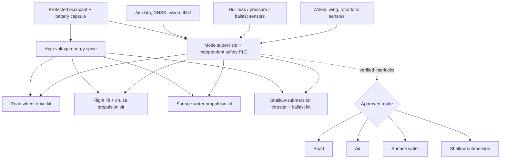

# Invention 3 — NEREID-4: Road, Air, Surface-Water, and Shallow-Submersion Vehicle Platform

**Evidence labels:** **[S] sourced**, **[I] inferred**, **[P] proposed design**, **[U] unresolved**.

## Executive definition

NEREID-4 is a **mode-separated electric vehicle architecture** intended to demonstrate four forms of mobility in controlled environments: road movement, low-altitude powered lift / forward flight, surface-water transit, and shallow controlled submersion. It is deliberately not described as a consumer flying car, a deep-diving personal submarine, or a vehicle ready for public-road or public-airspace operation.

> **Design claim [P]:** The best way to make a four-domain vehicle physically credible is not to maximize every mode. It is to use a common protected occupant capsule, a shared electrical energy spine, and **hard mode locks** so that each domain sees only the structures and actuators it needs at that time.

The FAA treats powered-lift certification as a system encompassing design, production, airworthiness and operations [S, 1]. Consequently, the NEREID programme treats aviation, road, surface-marine and submersible approvals as separate evidence packages. A single set of attractive images does not merge their safety cases.

## 1. System boundary and configuration

The retained baseline is a **two-occupant, electric, low-speed demonstrator**. It runs on a closed test road, flies within a controlled test range, operates as a small surface craft in protected water, and submerges only in a test basin to a predeclared shallow limit. At a nominal 3 m freshwater depth, the hydrostatic pressure increase is approximately 29.4 kPa [I, calculation file]. That value is not a hull-thickness design rule: buckling, fatigue, penetrations, corrosion and impact determine real structural requirements.

| Parameter | NEREID-4 baseline [P] | Reason for boundary |
|---|---|---|
| Occupants | 1 pilot + 1 test passenger or instrumentation load. | Minimises mass and evacuation complexity. |
| Road environment | Private / controlled facility only during prototype stages. | Road homologation is a separate programme. |
| Air mode | Controlled-range eVTOL and low-speed forward flight. | Avoids claiming public-airspace certification. |
| Surface mode | Protected water, low sea state. | Folded-flight structures are not a substitute for a sea-rated hull. |
| Submersion | Controlled, shallow basin; reference limit 3 m freshwater. | Deep-diving pressure-hull certification is excluded. |
| Propulsion | Distributed electric lift, road-wheel drive, waterjet / low-speed surface propulsion, and underwater thrusters. | Separates propulsor jobs rather than forcing one propulsor to work efficiently in all fluids. |
| Energy | Shared high-voltage traction battery with segregated reserve bus. | Provides common energy infrastructure while retaining safety isolation. |

## 2. The central contradiction and resolution

A car must withstand impacts and travel compactly. An aircraft needs low mass, lift area, redundancy and flight-quality control. A boat needs buoyancy and corrosion tolerance. A submarine needs a pressure boundary, ballast control and watertight penetrations. Combining all requirements naively gives an overweight and unsafe vehicle.

NEREID resolves the contradiction by dividing the vehicle into a **certification-bearing capsule** and **domain kits**. The capsule is a compact, watertight occupant / battery-pressure boundary with a low-drag external fairing. The flight kit consists of fold-out wings and distributed electric lift units. The road kit consists of retractable suspension and wheel drives. The water kit has surface propulsion plus underwater thrusters, ballast tanks and mechanically isolated water interfaces. No mode is allowed unless sensors prove that the other mode’s actuators are in their safe positions.

## 3. Physical layout

The vehicle is shaped as a low, broad central capsule with a retractable road undercarriage. Folded lifting surfaces sit above the waterline and lock against the body during road and water modes. Ducted electric lift units are carried on deployable booms; a separate rear electric propulsor provides forward flight thrust. Surface-water transit uses protected waterjets or low-speed propellers aft, while submersion uses small vectored ducted thrusters. A reserve buoyancy volume is not used as battery space.

| Physical zone | Proposed structure | Domain contribution | Critical qualification |
|---|---|---|---|
| Central capsule | Fibre-reinforced composite shell with an internal metallic or composite-lined pressure boundary; external crash / hydrodynamic fairing. | Occupant, battery and avionics protection; buoyancy core; shallow pressure boundary. | Crash-energy management, leak integrity, cyclic external-pressure, lightning / electromagnetic safety. |
| Road module | Retractable independent suspension, four in-wheel or e-axle drives, deployable road lights and bumpers. | Ground movement and stable launch / recovery platform. | Braking, steering, crash response, road-spray / salt isolation. |
| Flight module | Locking wing panels and redundant distributed lift rotors; rear cruise propulsor. | Vertical lift and low-speed flight. | Structural flutter, rotor-out response, thermal derating, command / sensor integrity. |
| Surface-water module | Twin protected waterjets, trim tabs, surface bilge and dewatering system. | Low-speed boat function and surface recovery. | Corrosion, water ingestion, stability in defined sea state, propulsor guarding. |
| Submersion module | Seawater-compatible variable ballast, high-integrity vents, low-speed vectored thrusters, upward-recovery reserve. | Controlled shallow descent, hovering, and ascent. | Positive-reserve-buoyancy test, leak detection, emergency blow / ascent, entanglement protection. |
| Energy / electronics | Segregated high-voltage battery compartments, contactors, fuses, dielectric monitoring, low-voltage safety reserve. | Powers every domain with isolated failure paths. | Immersion fault isolation, thermal runaway response, service disconnect, saltwater exposure. |

## 4. Mode-state machine

The invention’s highest-value mechanism is the **mode supervisor**. It is designed as an independently powered safety controller, separate from the vehicle computer. It prevents a change of domain if locks, seals, water state, energy reserve, weather / water conditions, or navigation status are invalid. The control system cannot declare a configuration valid based on a single sensor.

| Mode | Required configuration | Inhibited when | Immediate safe action |
|---|---|---|---|
| Road | Wings / booms fully stowed and locked; ballast empty or in road-safe state; watertight doors closed; wheel suspension deployed. | Wing or boom lock uncertain, high-voltage isolation fault, ballast-level disagreement. | Reduce speed, stop in a safe zone, isolate high-voltage propulsion if needed. |
| Air | Road gear locked in flight configuration; wings and all lift units independently locked; predicted energy reserve meets a no-diversion threshold; water system sealed. | Any actuator lock ambiguity, battery overtemperature, poor sensor agreement, water ingress. | Reject take-off or execute predefined land-now contingency. |
| Surface water | Flight hardware stowed / locked; wheel system stowed or water-safe; buoyancy and bilge status verified. | Leak, inadequate freeboard, ballast sensor discrepancy, unsafe declared sea state. | Return to dock / shore under minimum safe propulsion. |
| Shallow submersion | Occupant capsule sealed; all vents in validated state; water depth / exclusion zone approved; positive-reserve-buoyancy system armed; continuous tether or recovery policy defined for first stages. | Any leak, depth-sensor disagreement, unavailable emergency ascent, battery insulation fault. | Stop descent; eject ballast / activate ascent mode; surface and dewater. |

### Formal safety invariants

**Definition [P].** Let \(q_m\) be the validity score for mode \(m\), consisting of independent lock, sensor and condition checks. A commanded transition is admitted only when

\[
q_m=\bigwedge_{j=1}^{n} (s_j\in\mathcal S_{j,\mathrm{valid}})\ \land\ R_E\ge R_{m,\min}\ \land\ M_H\ge M_{H,\min},
\]

where \(R_E\) is verified energy reserve and \(M_H\) is the relevant hull / buoyancy margin. Mode changes are **fail-closed**: loss of state information prevents entry into a more hazardous mode and activates the defined recovery action. This is a specification target requiring independent hardware and software verification.

For submersion, the positive-ascent condition is

\[
F_{\mathrm{buoyancy}}-W-F_{\mathrm{drag,down}}>F_{\mathrm{reserve}}>0
\]

under the loss of normal propulsion and control. The project must validate this experimentally in the exact vehicle configuration; a calculated displacement alone is inadequate.

## 5. Aerodynamic, hydrodynamic, and pressure design choices

The vehicle uses **folded, not dual-purpose, surfaces**. Its flight wing is not asked to be a deep-submergence pressure hull; its wheel fairing is not a flight-critical lifting surface; its surface-water propulsion is not used for airborne thrust. This reduces cross-domain coupling at the cost of mass and complexity.

The central capsule uses a rounded pressure-bearing geometry because external-pressure stability improves with curvature compared with flat panels. The vehicle’s early submersion limit remains shallow because every window, connector, shaft, hatch, camera, cooling interface, and antenna is a pressure-boundary risk. The initial programme should avoid a crewed deep-submergence claim entirely.

| Trade-off | Rejected naive approach | NEREID response | Residual risk |
|---|---|---|---|
| Lift vs. road width | Permanent large wings. | Foldable / lockable wing panels and distributed lift booms. | Fold joints and locks raise certification burden. |
| Aircraft mass vs. submarine structure | Deep-rated vehicle pressure hull. | Shallow-rated rounded capsule plus a basin-only operating limit. | Still heavier than a pure eVTOL. |
| Surface buoyancy vs. flight mass | Large permanent pontoons. | Buoyancy inside capsule and slim deployable / fairing-supported water stability surfaces. | Surface stability may limit sea state severely. |
| One motor for every medium | Shared propeller / wheel / pump. | Separate protected propulsors on common electrical bus. | Cost, volume, and maintenance increase. |
| Emergency response | “AI will handle it.” | Mechanical locks, separate safety controller, positive-reserve buoyancy, manual physical release paths. | Human factors and common-mode electrical faults remain. |

## 6. Manufacturing plan

The NEREID programme begins with non-crewed articles. The flight article is not simultaneously the submersion article until material, joint, immersion, and control evidence makes the integration credible.

| Work package | Manufacturing approach | Acceptance evidence |
|---|---|---|
| Capsule demonstrator | Tooled composite shell with documented layup, coupon programme, non-destructive inspection; replaceable sealing interfaces. | Coupon strength / fatigue evidence, vacuum and low-pressure leak test, controlled shallow immersion cycles. |
| Road bogie article | Steel/aluminium fixture with production-intent wheel drives and suspension. | Braking, steering, pothole / curb surrogate, ingress protection. |
| Flight rig | Ground-tethered structural frame with flight motors, rotor guards, and production-intent locks. | Thrust margin, rotor-out handling, vibration, thermal response, deployment-cycle endurance. |
| Water module rig | Salt-fog-capable waterjet / thruster fixture with ballasting and bilge components. | Corrosion test, debris ingestion, leak / dewatering performance. |
| Safety controller | Independent hardware with traceable requirements and test harness. | Fault-injection evidence showing it denies unsafe transitions and commands recovery. |
| Integrated unmanned demonstrator | Instrumented remotely supervised vehicle in enclosed sites. | Demonstrate every transition after hazard review; no crew carried. |

The later crewed article must follow a formal hazard analysis, failure modes and effects analysis, structural substantiation, electromagnetic compatibility programme, software assurance plan, and certification engagement. The FAA’s powered-lift framework confirms that aircraft certification and operation must be addressed as a full system, not only as vehicle hardware [S, 1]. National road and marine regulators must be engaged separately in the intended jurisdiction.

## 7. Test and validation sequence

| Phase | Test scope | Objective criterion | Failure that stops the programme |
|---|---|---|---|
| 0 | Virtual configuration / load model | Mass, centre-of-gravity and energy-reserve model closes with specified contingency margins. | No feasible mass / reserve budget. |
| 1 | Dry mechanical article | 10,000 deployment-lock cycles and predetermined proof loads without unacceptable wear or false-lock state. | Joint or sensor degradation that lacks a credible inspection / replacement path. |
| 2 | Uncrewed road and surface-water article | Demonstrate stable braking, launch/recovery, flotation and dewatering in controlled conditions. | Water ingress to energy or safety compartments. |
| 3 | Tethered / restricted flight rig | Demonstrate commanded lift, safe thrust degradation, and flight-mode lock evidence. | Uncontrolled response to a single motor, sensor, or lock fault. |
| 4 | Uncrewed shallow-basin submersion | Complete repeated descent–hover–ascent cycles; prove positive emergency ascent. | Any failure to surface on a normal-propulsion-loss drill. |
| 5 | Integrated unmanned transitions | Controlled road–surface–submersion and ground–flight transitions on separate days, then only after review combined use. | Cross-domain fault cascade or a mode transition that enters an unsafe state. |
| 6 | Crewed test decision | Independent safety review and evidence package. | Do not proceed absent regulator / test-safety approval. |

## 8. Validation scorecard

| Criterion | Assessment |
|---|---|
| Mechanism clarity | High: common capsule + modular domain kits + hard mode interlocks. |
| Feasibility | Moderate for individual modes; low for an integrated all-domain crewed demonstrator because mass and certification effects compound. |
| Safety | Requires conservative staged testing; deep submersion and public operation are explicitly excluded from baseline. |
| Strongest competing approach | A modular vehicle with detachable flight or submersible pod is mechanically simpler and likely more practical. |
| Decisive test | An unmanned basin / flight rig must prove that every single credible lock, leak, sensor, and propulsion fault leaves the vehicle in a recoverable state. |
| Confidence | High that the concept properly frames the systems engineering problem; low that it can be commercialised as a one-vehicle consumer product without major compromises. |

## Reference

[1] [Federal Aviation Administration, “Advanced Air Mobility | Air Taxis.”](https://www.faa.gov/air-taxis)
