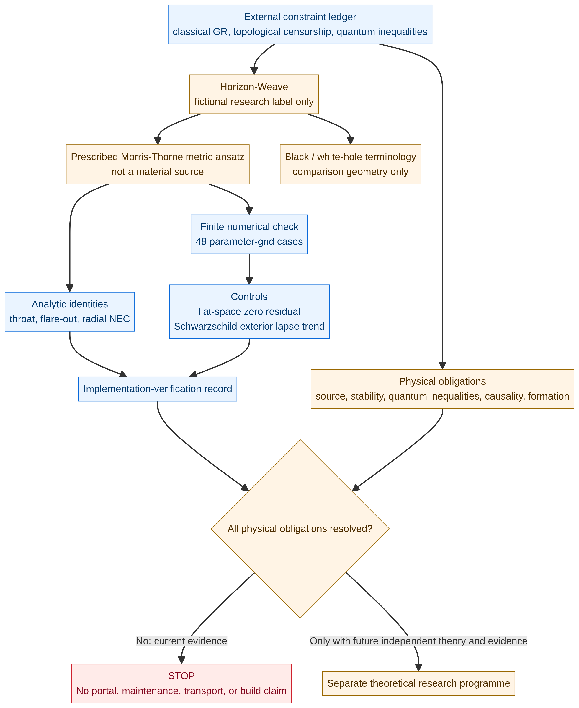
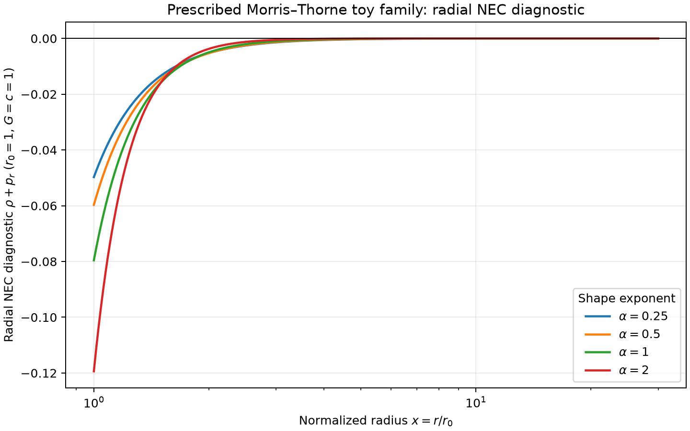
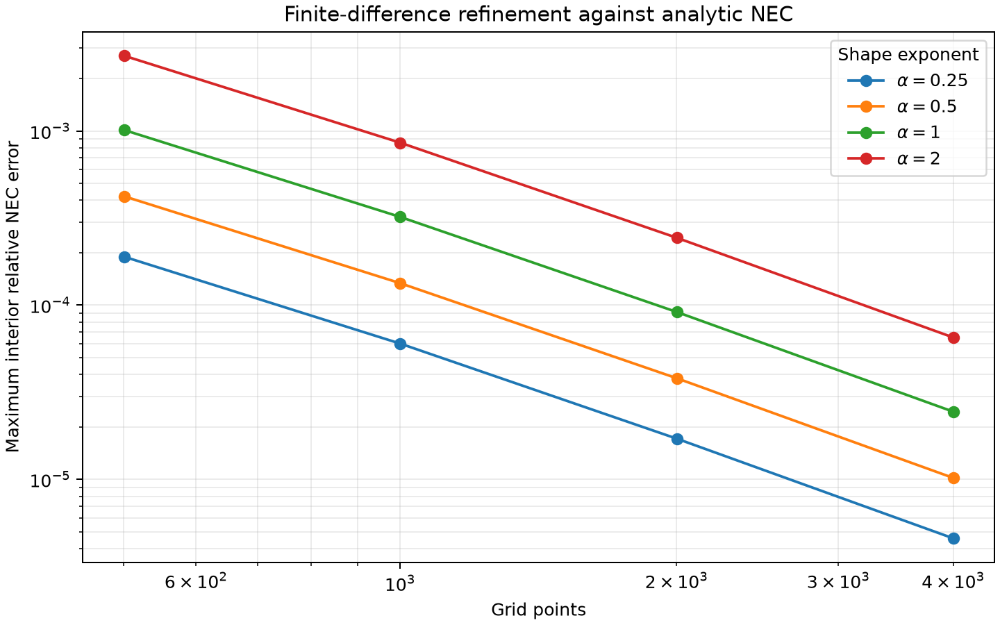
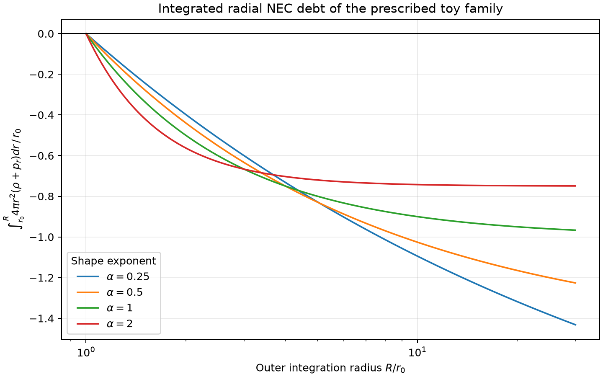

# Horizon-Weave Portal Topology Lab

> **Research boundary.** This is a bounded general-relativity study of prescribed toy geometries. It does **not** maintain a wormhole, create or control a black hole or white hole, produce a portal, enable faster-than-light travel, or provide a fabrication, safety, or transport design.



## Executive finding

A static Morris–Thorne-style metric can be written so that its derived radial null-energy-condition diagnostic is negative at and outside a horizon-free throat. That observation is an attribute of the **assumed geometry and its implied stress-energy**, not a discovered material or engineering mechanism. The code in this package verifies that narrow calculation over a finite parameter/grid set, with analytic identities, a flat-space negative control, a Schwarzschild lapse comparison, and refinement checks.

The actual physical question remains open at a much more demanding level. The original Morris–Thorne analysis required unusual throat stress-energy behavior [1]. Topological censorship constrains accessible nontrivial topology under its stated global and null-energy assumptions [2], while Ford and Roman’s quantum-inequality analysis reported severe restrictions for the static traversable geometries it examined [3]. No result here removes those constraints.

| Question | Current conclusion |
|---|---|
| Can the selected zero-redshift metric’s equations be evaluated reproducibly? | **Yes.** The implementation passed 5 regression tests and 48 finite cases. |
| Does the finite computation show a radial NEC violation for the chosen ansatz? | **Yes, as expected from the analytic formula.** |
| Does that show a physical source can maintain a wormhole? | **No.** Source, quantum consistency, stability, formation, and causal analysis are unresolved. |
| Do black or white holes supply a maintenance route? | **No support in this package.** They are comparison/terminology only. |
| Is Horizon-Weave a portal invention or build design? | **No. The proposal is rejected at the no-build gate.** |

## What was mathematically tested

The toy family uses geometrized units \(G=c=1\), zero redshift \(\Phi=0\), and

\[
b(r)=r_0\left(\frac{r_0}{r}\right)^\alpha,
\qquad r_0>0,\quad\alpha>0.
\]

For this selected family, the package computes

\[
\rho+p_r=-\frac{(\alpha+1)r_0^{\alpha+1}}{8\pi r^{\alpha+3}}<0.
\]

It sweeps \(\alpha\in\{0.25,0.5,1,2\}\), \(r_0\in\{0.5,1,2\}\), and four grid resolutions. The plotted quantities and the numerical manifest are finite **implementation-verification evidence**, not validation of a physical model.

| Artifact | Purpose |
|---|---|
| [`REFINED_DESIGN.md`](REFINED_DESIGN.md) | Separates the toy wormhole ansatz from black-hole and white-hole comparison terminology. |
| [`PROOF_GAP.md`](PROOF_GAP.md) | Records the no-build decision, unresolved physics, and reversal conditions. |
| [`REVERSAL_CRITERIA.md`](REVERSAL_CRITERIA.md) | Defines the six linked criteria that would be required to reverse the no-build decision. |
| [`ADVERSARIAL_RESULTS.md`](ADVERSARIAL_RESULTS.md) | Records the independent symbolic and numerical audit and explains why it does not satisfy physical reversal criteria. |
| [`simulation/MODEL_SPEC.md`](simulation/MODEL_SPEC.md) | Defines equations, units, assumptions, controls, VVUQ status, and stop criteria. |
| [`simulation/FORMAL_CLAIM.md`](simulation/FORMAL_CLAIM.md) | States the exact symbolic/finite claim boundary and counterexample strategy. |
| [`simulation/EXTERNAL_CONSTRAINTS_LEDGER.md`](simulation/EXTERNAL_CONSTRAINTS_LEDGER.md) | Cites the governing theoretical constraints. |
| [`simulation/RESULTS.md`](simulation/RESULTS.md) | Summarizes the verified finite result and its limitations. |
| [`simulation/outputs/`](simulation/outputs/) | Contains CSV profiles, plots, case summary, provenance manifest, output hashes, independent-audit results, and a symbolic certificate. |

## Reproduce the finite study

Run the following commands from the simulation directory.

```bash
python3 test_model.py
python3 model.py
python3 validate_outputs.py
python3 test_adversarial_audit.py
python3 adversarial_audit.py
python3 symbolic_audit.py
python3 /home/ubuntu/skills/eureka-formal-logic-lab/scripts/validate_formal_claim.py FORMAL_CLAIM.md
```

The test suite verifies the analytic formula, throat and flare-out identities, flat-space control, horizon-lapse comparison, and error reduction under refinement. `validate_outputs.py` checks all recorded cases. Neither validator proves the equations physically describe nature.

## Figures







## No-build conclusion

The package deliberately stops before any energy budget, hardware architecture, operational sequence, safety plan, or human/object transit scenario. A future theory programme would need a self-consistent source model, quantum-inequality compatibility, dynamical/backreaction stability, global causal analysis, and empirical support before it could even reassess this decision. See [`PROOF_GAP.md`](PROOF_GAP.md).

## References

[1] [Morris, M. S. and Thorne, K. S., “Wormholes in spacetime and their use for interstellar travel,” *American Journal of Physics* 56, 395–412 (1988).](https://doi.org/10.1119/1.15620)

[2] [Friedman, J. L., Schleich, K. and Witt, D. M., “Topological Censorship,” *Physical Review Letters* 71, 1486–1489 (1993), corrected version on arXiv.](https://arxiv.org/abs/gr-qc/9305017)

[3] [Ford, L. H. and Roman, T. A., “Quantum field theory constrains traversable wormhole geometries,” *Physical Review D* 53, 5496–5507 (1996).](https://doi.org/10.1103/PhysRevD.53.5496)

[4] [Guendelman, E. et al., “Kruskal-Penrose Formalism for Lightlike Thin-Shell Wormholes,” (2016).](https://arxiv.org/abs/1512.08029)
