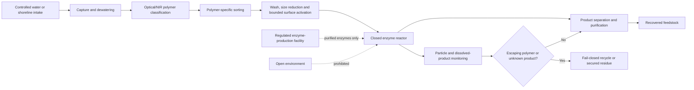

# MYCO-CLEAN — Refined Design Specification

**Revision status:** contained enzyme-recovery platform; environmental release and single universal fungus claims withdrawn.
**Evidence labels:** **[S] sourced**, **[I] inferred**, **[P] proposed**, **[U] unresolved**.

## Purpose and corrected claim

MYCO-CLEAN is a proposed system that removes plastic from a controlled feed stream, identifies polymer classes, applies polymer-specific pretreatment and biocatalysis, and recovers measurable products. The first target is PET. PE, PP, PS and PVC remain separate research streams because their chemistry, rates, product distributions and hazard profiles differ.

The platform does not claim that plastic “disappears.” A valid outcome is a closed mass balance showing polymer conversion into identified products, retained solids, gases and recoverable feedstock. Producing smaller particles or unmeasured carbon dioxide is not equivalent to circular recycling.

## System architecture



The separation between enzyme production and the reactor is deliberate. Fungal strains may be useful as discovery or manufacturing chassis, but the ocean-facing module receives no viable engineered biomass under this design.

## Sequence-free RNA and protein blueprint

The requested “RNA based on the final proteins” is converted here into a **functional design specification**, not a nucleotide sequence or genetic construction recipe. The package intentionally omits coding sequences, promoters, untranslated-region choices, codon optimization, assembly instructions, transformation methods and culture conditions.

### Catalytic modules

| Module card | Protein function | Intended polymer | Evidence status |
|---|---|---|---|
| `PET-HYDROLASE` | Surface-active polyester hydrolase/cutinase class that cleaves PET ester bonds. | PET | **[S]** Supported as a research direction by the *I. sakaiensis* pathway and later enzyme studies. |
| `MHET-BHET-HYDROLASE` | Secondary hydrolysis of soluble PET intermediates toward separable building blocks. | PET | **[S]** Supported as a two-step pathway; process performance remains condition-dependent. |
| `PUR-ESTER/URETHANE` | Esterase/lipase/protease/urethane-active enzyme panel for screening product distributions. | PUR | **[S]** Fungal enzyme classes are reported; industrial selectivity is **[U]**. |
| `POLYOLEFIN-OXIDATION` | Oxidative surface-activation and downstream conversion candidates. | PE/PP/PS | **[U]** Discovery-only; pretreatment dependence, rate and product fate are not closed. |
| `PRODUCT-RECOVERY` | Binding, transport or separation aids selected for known products; not a claim of a single universal enzyme. | Process layer | **[P]** Must be selected after product analytics. |

The sequence-free rule also prevents a common error: taking a gene label as proof that a protein will fold, secrete, remain stable, or work on a mixed waste stream.

### Folding, export and process-support modules

| Support layer | Required function | Why it is included |
|---|---|---|
| Secretion/compartment targeting | Move a candidate enzyme to the intended extracellular or cell-free production compartment. | Catalysis is otherwise limited by localization. |
| Chaperone and quality control | Support folding, maturation and removal of misfolded material. | Protein expression is not equivalent to active enzyme. |
| Cofactor/redox support | Maintain any required oxidation-state and cofactor balance in the production chassis or reactor. | Oxidative candidates can fail through cofactor starvation. |
| Protease and stability control | Reduce unwanted degradation and quantify active half-life. | Reactor lifetime is a design variable, not a sequence assumption. |
| Immobilization/retention interface | Keep enzymes inside the reactor and permit regeneration or replacement. | Prevents release and improves process control. |

### Life-cycle-sustaining modules for any future living production chassis

These are **functional categories**, not a list of genes to assemble:

| Life-cycle function | Minimum design question |
|---|---|
| Genome replication and repair | Can the chassis maintain genetic integrity without selecting for loss of the production trait? |
| Transcription, translation and ribosome homeostasis | Can it sustain the protein burden without a hidden growth defect? |
| Central carbon, nitrogen and lipid metabolism | What nutrients sustain biomass, and which products or wastes accumulate? |
| Membrane, cell-wall and vesicle trafficking | Can it maintain integrity, secretion and morphology over the production cycle? |
| Oxidative, osmotic, thermal and starvation stress response | Does the production environment create a survival phenotype that changes containment risk? |
| Cell-cycle, hyphal morphology and sporulation control | Can the process avoid uncontrolled dissemination or persistent spores? |
| Autophagy and turnover | Can damaged proteins and organelles be cleared without releasing unwanted material? |
| Genetic stability and containment dependency | Is growth dependent on a supplied factor or other independently audited barrier? |

No living chassis is authorized by this document. NIH/IBC review and applicable local requirements would be a precondition for any recombinant or synthetic-nucleic-acid work [6].

### Conceptual RNA product cards

The safe deliverable is a set of reviewable cards rather than a sequence:

```text
RNA-PET-CATALYSIS
  regulated expression boundary
  → PET-HYDROLASE protein product
  → MHET-BHET-HYDROLASE protein product
  → measurable product analytics

RNA-PET-SUPPORT
  folding/export/stability/cofactor support categories
  → active enzyme fraction and half-life measurements

RNA-PET-LIFE-CYCLE
  housekeeping, metabolism, stress, morphology and genetic-stability categories
  → growth burden and containment evidence

RNA-PET-CONTAINMENT
  independently audited dependency and fail-closed shutdown categories
  → no environmental release and no unreviewed persistence claim
```

The design rule is modularity: each catalytic or support module should first be evaluated in a nonliving or cell-free context, with a matched inactive-enzyme control and an analytical product assay. Combining modules into a viable organism is a later, separately approved decision—not the default implementation.

## Device modules

### MYCO-SORT

Optical/NIR classification assigns material to a polymer-specific process lane. Uncertainty, black-pigment interference, labels, multilayers and biofouling must be logged; uncertain items go to a reject/residue lane.

### MYCO-PRE

Mechanical size reduction, washing and bounded surface activation expose more area while retaining all solids and liquids. For PE, sunlight/UV-like activation is treated as a controlled process variable, never as permission to release a fungus into seawater.

### MYCO-REACT

The primary reactor is closed and enzyme-based. Immobilized or retained enzymes are preferred because they permit separation, replacement and effluent monitoring. Living biomass is excluded from the ocean-facing device.

### MYCO-RECOVER

Product streams are separated and identified before being called feedstock. For PET, the benchmark is recovery of defined building blocks; for PE and other polyolefins, carbon balance and by-product toxicity remain unresolved.

## Decisive first test

The smallest useful test is a closed PET-flake benchmark against a matched mechanical-recycling baseline and an inactive-enzyme negative control. Measure:

- polymer mass entering and leaving each boundary;
- particle-size distribution in the effluent;
- identified soluble products and unassigned organic carbon;
- enzyme activity over time;
- energy per kilogram of accepted feed;
- product recovery yield and purity;
- residue and wastewater hazard indicators.

The present concept is supported only if the active system shows a reproducible improvement in **identified recoverable feedstock per unit energy** without an increase in unaccounted particles or hazardous residues. Failure of mass closure, particle containment or product identification reverses the design toward mechanical/thermal processing or terminates the biological branch.

## Proof-gap ledger

| Gap | Why it matters | Reversal condition |
|---|---|---|
| Mixed-waste sorting accuracy | Cross-contamination can poison the enzyme lane and invalidate product claims. | Calibrated classifier and reject-lane rate under representative fouling. |
| Reactor kinetics and enzyme lifetime | Published activity does not establish process throughput. | Replicated time-course with product inhibition and aging. |
| PE/PP/PS product fate | Oxidation or mineralization may create fragments or emissions rather than useful feedstock. | Complete carbon/product/toxicity balance under controlled pretreatment. |
| Marine deployment | Open release adds ecological and regulatory uncertainty. | Not a target of this package; deployment remains prohibited. |
| Living chassis safety | Recombinant organisms can persist, mutate or disseminate. | Independent biosafety review, containment evidence and authorization; absent by default. |

## Decision

**Continue with PET, closed-reactor, purified/immobilized-enzyme first articles. Reframe PE and any living-fungus concept as contained discovery work only.** Confidence is moderate for the architecture and low for scale, mixed-feed performance and environmental benefit.
