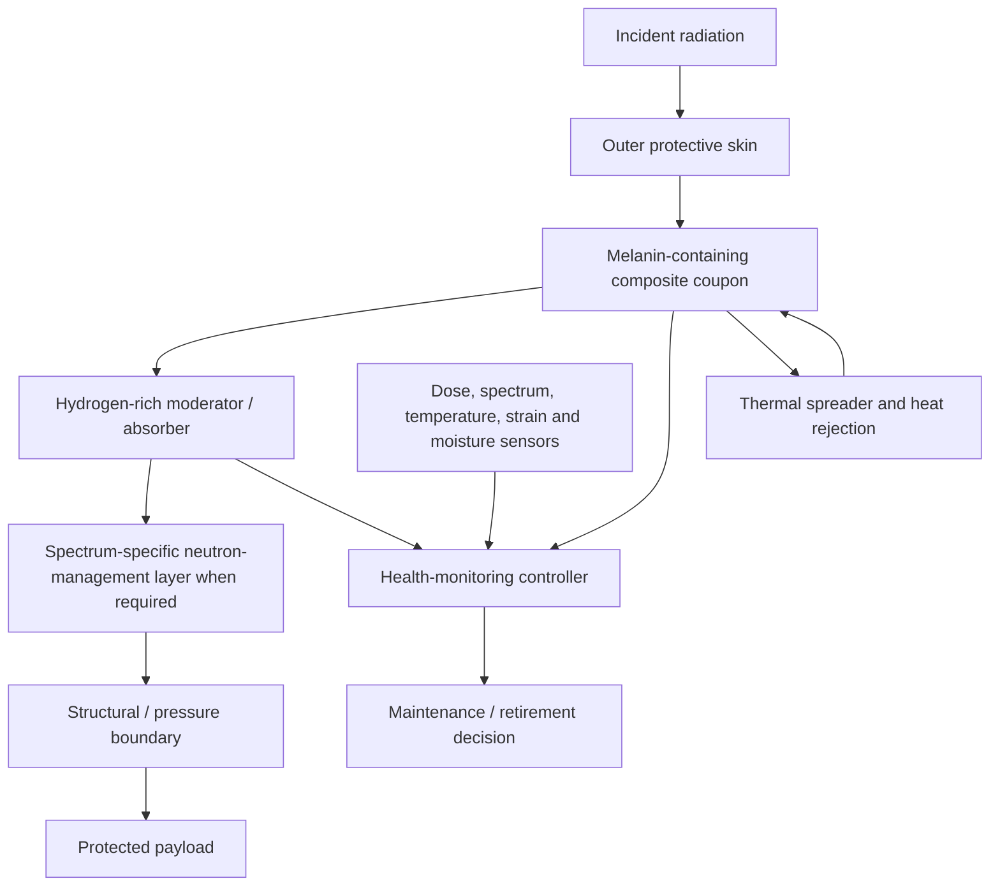

# MEL-SHIELD — Refined Design Specification

**Revision status:** nonliving, multilayer radiation-management coupon; “radiation exterminator” and direct living-fungus shield claims withdrawn.
**Evidence labels:** **[S] sourced**, **[I] inferred**, **[P] proposed**, **[U] unresolved**.

## Purpose and corrected claim

MEL-SHIELD asks whether a melanin-containing composite can improve a conventional radiation-management stack on a clearly defined spectrum, dose and aging test while retaining acceptable mass, thermal and mechanical properties. The design does not claim that radioactive nuclei are destroyed. Absorption or scattering transfers energy to the material, and radionuclide immobilization only changes location and mobility.

## What the biology does and does not provide

Dadachova et al. reported radiation-associated changes in melanin electron-transfer behavior and growth effects in melanized fungi [1]. NASA's spaceflight investigation separates melanin pigmentation from DNA-repair pathways and measures survival, gene expression, genome changes, proteins, metabolites and biomass [2]. These are evidence for studying mechanisms; they are not a ready-made shield or a proof of useful energy harvesting.

## Sequence-free RNA and protein blueprint

The requested RNA design is recorded as a functional research map only. No nucleotide sequences, promoters, untranslated-region designs, codon optimization, assembly steps, transformation methods, growth conditions or radiation-exposure protocols are included.

### Material-production pathway cards

| Module card | Protein-function class | Intended output | Status |
|---|---|---|---|
| `MEL-PRECURSOR` | Polyketide-synthase-centered precursor-generation activity. | Melanin precursor pool. | **[S]** A DHN-melanin pathway is a sourced research direction; exact strain choice is unresolved. |
| `MEL-REDOX-CASCADE` | Reductase/dehydratase/oxidative polymer-formation functions. | Chemically characterized melanin-like material. | **[P]** Composition and yield must be measured. |
| `MEL-ASSEMBLY` | Cell-wall, vesicle and extracellular-matrix deposition functions. | Controlled particle/film morphology in a biological production system. | **[P]** Architecture may not transfer to purified material. |
| `MEL-HARVEST` | Compartment separation, particle retention and cleanup functions. | Purified, traceable material feed. | **[P]** Must not release viable biomass. |

### Radiation-response and life-cycle support cards

| Support layer | Functional categories to measure | Why it matters |
|---|---|---|
| DNA damage response | Homologous-recombination and end-joining repair categories, checkpoint and repair coordination. | Radiation survival is not the same as shielding performance. |
| Redox and oxidative stress | Antioxidant, electron-transfer, ROS management and cofactor-balancing categories. | Radiation can change redox state and damage cellular components. |
| Core life cycle | Genome replication, transcription, translation, ribosome biogenesis and central metabolism. | A production strain still needs a stable life cycle. |
| Morphology and envelope | Membrane, cell-wall, vesicle trafficking, hyphal morphology and sporulation control. | Morphology changes material output and containment risk. |
| Stress and repair | Osmotic, thermal, starvation, proteostasis and autophagy categories. | Production and radiation stress can select for unexpected phenotypes. |
| Genetic stability and containment | Dependency, retention, shutdown and non-persistence barriers. | Any living chassis would require independent biosafety review. |

### Conceptual RNA product cards

```text
RNA-MEL-BIOSYN
  regulated expression boundary
  → precursor-generation activity
  → redox/polymer-formation activity
  → chemistry and morphology analytics

RNA-MEL-SURVIVAL
  DNA-repair, redox, stress and core-life-cycle categories
  → survival/phenotype measurements only

RNA-MEL-MATERIAL
  deposition, particle retention and harvest categories
  → purified material with batch traceability

RNA-MEL-CONTAINMENT
  independently reviewed dependency and shutdown categories
  → no release and no persistence claim
```

The design deliberately separates **biology used to make material** from the **nonliving deployed material**. A viable engineered fungus is not part of the first article. Any future recombinant or synthetic-nucleic-acid work would need applicable institutional, funder, and jurisdictional review; where the NIH Guidelines apply, their institutional requirements must be followed [5].

## Multilayer device architecture



The layer order is not universal. Dense materials, hydrogen-rich materials and neutron absorbers have spectrum-dependent trade-offs, including secondary radiation and mass. A calibrated radiation-transport analysis is required before any operational conclusion.

## Optional MEL-CONVERTER research branch

```text
irradiation
  → melanin electronic/redox perturbation
  → test electrode or mediator
  → measure open-circuit signal and net harvested energy
```

This is a falsifiable materials experiment, not a power-system claim. The decisive metric is net energy after instrumentation, bias, cooling and shielding penalties. A nonzero signal is insufficient if it does not exceed noise and parasitic consumption.

## Decisive first test

Fabricate matched coupons with:

1. a conventional reference stack;
2. the same stack plus a melanin-containing layer;
3. a pigment/matrix negative control matched for density, color and thickness.

Expose the coupons to a declared spectrum and dose range using calibrated dosimetry. Measure transmitted dose, secondary particle signatures where relevant, temperature, mass, mechanical integrity, moisture response and post-exposure chemistry. Test multiple independent coupons and report uncertainty.

The concept survives only if the melanin coupon produces a reproducible, spectrum-specific improvement at an acceptable areal-mass and aging penalty. A visually darker coupon, a redox signal or a model result alone is not a shield qualification.

## Proof-gap ledger

| Gap | Why it matters | Reversal condition |
|---|---|---|
| Spectrum dependence | Gamma/X-ray, proton, heavy-ion and neutron environments are not interchangeable. | Calibrated tests across the declared use spectrum. |
| Dose and aging | Radiation may change chemistry, strength or permeability. | Longitudinal aging with post-test material characterization. |
| Secondary radiation | A new layer may worsen a different radiation component. | Transport measurement or validated simulation with independent checks. |
| Thermal/mechanical integration | Absorption deposits energy and the composite must survive its environment. | Coupled thermal, mechanical and radiation qualification. |
| Energy harvesting | Redox/electrical response may be too small or transient to use. | Net-energy test above noise and parasitic load. |
| Living-fungus route | Persistence and biosafety are not solved by a useful pigment. | Independent biosafety review and authorization; absent by default. |

## Decision

**Continue MEL-SHIELD as a nonliving material coupon study. Treat MEL-CONVERTER as speculative instrumentation research. Do not claim radiation destruction, human readiness, spaceflight readiness or radioactive-waste clearance.** Confidence is moderate for the research direction and low for any performance improvement until calibrated tests exist.
