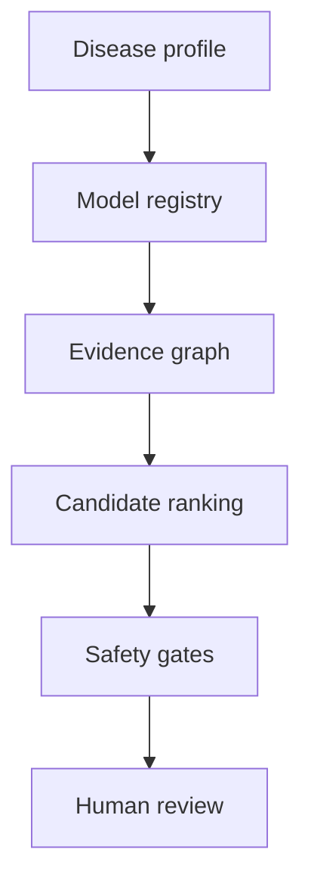

# NeuroForge: Neuro-regenerative Research Twin

NeuroForge is a safety-constrained computational research twin for comparing
disease-specific neuro-regenerative strategies and generative research
hypotheses. It links disease profiles, human-cell model systems, organoids and
barrier models, candidate modalities, evidence provenance, uncertainty, and
translation review gates.

**Research use only.** NeuroForge is not a treatment, clinical decision system,
cell-production protocol, gene-editing designer, dosing tool, or patient-specific
recommendation engine. It must not authorize transplantation, manufacture,
synthesis, ordering, or clinical deployment.

## Why this framing

Parkinson disease, spinal-cord injury, stroke, ALS, Alzheimer disease, and
inherited disorders have different lesions, cell populations, mechanisms,
time windows, and endpoints. A universal genetic-correction chamber is not a
credible or safe default delivery model. NeuroForge keeps the earlier chamber
idea as a visualization metaphor only; real translational paths remain
disease-, product-, and jurisdiction-specific.

## Initial scope (V1)

V1 is a Parkinson disease research twin focused on dopaminergic cell-replacement
evidence. Other modalities (trophic support, small molecules, extracellular
vesicles, biomaterials, RNA/gene research, bioelectric adjuncts, and
rehabilitation) may appear as high-level literature comparators, but V1 does not
design them. Spinal-cord injury is deferred to a separate future module because
its anatomy, timing, endpoints, and translation risks differ.

Every claim carries an evidence label, source, model context, uncertainty,
transferability limits, and review status. “Neuro-regenerative” does not mean
cure, genome correction, or disease reversal.

## System layers

1. **Disease profile:** mechanism, target cell population, measurable phenotype,
   time window, endpoints, and known uncertainty.
2. **Model registry:** human iPSC-derived cells, organoids/assembloids,
   BBB-on-chip, animal-study metadata, and clinical evidence metadata.
3. **Candidate registry:** dopaminergic cell-replacement research candidates;
   other modalities are comparator metadata only.
4. **Generative analysis:** retrieval-grounded hypothesis generation,
   mechanism-to-readout mapping, candidate comparison, and evidence-gap finding.
5. **Translation gates:** identity, purity, genomic stability, tumorigenicity,
   immune compatibility, biodistribution, durability, function, and oversight.

## Non-goals and hard blocks

- No patient-specific diagnosis, treatment recommendation, dose, route, or schedule.
- No guide RNA, vector, construct, synthesis-ready sequence, or cell-manufacturing recipe.
- No raw genomes, identifiable health records, or donor-identifying metadata in Git.
- No automatic advancement, external vendor/lab/EHR connection, or clinical export.
- No claim of efficacy, approval, or safety without verified evidence.

## Package map

- `docs/` — architecture, intended use, safety, translation, evidence, limitations, roadmap.
- `schemas/` — machine-readable data contracts with provenance and refusal fields.
- `examples/` — synthetic, non-operational records only.
- `governance/` — review checklist, data provenance, and red lines.
- `tests/` — offline validation of schemas, provenance, and refusal behavior.

## Evidence anchors

The package uses public sources as evidence anchors, not as clinical recommendations:

- [Investigational iPSC-derived dopaminergic cell replacement in Parkinson disease](https://www.nature.com/articles/s41586-025-08700-0)
- [ISSCR 2026 Parkinson update](https://www.isscr.org/isscr-news/new-clinical-data-presented-at-isscr-2026-advance-stem-cell-based-cell-therapy-for-parkinsons-disease)
- [Neural organoid bioelectronic monitoring review](https://www.nature.com/articles/s41378-025-01038-7)
- [ISSCR targeted guideline update](https://www.isscr.org/isscr-news/the-isscr-releases-targeted-update-to-the-guidelines-for-stem-cell-research-and-clinical-translation)

These sources support feasibility and research directions; they do not establish
a universal therapy or a clinical product. Spinal-cord-injury evidence is kept
out of the V1 evidence graph and reserved for a future package.

## Status

Design/prototype specification. No biological experiment, patient data, or
clinical decision is performed by this repository.
